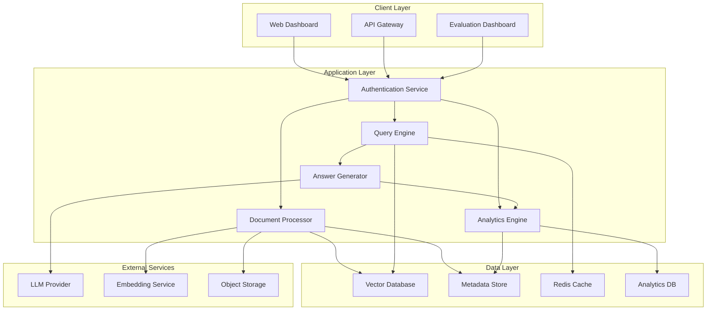

# Design Document: Production Grade RAG System

## Overview

This document outlines the design for a Production Grade Retrieval Augmented Generation (RAG) System that provides enterprise-level document processing, semantic search, and AI-powered question answering capabilities. The system is architected for high availability, scalability, and security while supporting multilingual operations and comprehensive analytics.

The design follows a microservices architecture with clear separation of concerns, enabling independent scaling and maintenance of different system components. The system leverages modern vector databases, hybrid search techniques, and advanced chunking strategies to deliver accurate, contextual responses with full source attribution.

## Architecture

### High-Level Architecture



### Component Architecture

The system is designed as a distributed microservices architecture with the following key principles:

1. **Stateless Services**: All application services are stateless to enable horizontal scaling
2. **Event-Driven Processing**: Asynchronous document processing using message queues
3. **Caching Strategy**: Multi-level caching for embeddings, query results, and metadata
4. **Fault Tolerance**: Circuit breakers, retries, and graceful degradation
5. **Security-First**: Zero-trust architecture with end-to-end encryption

## Components and Interfaces

### Document Processor Service

**Responsibilities:**
- PDF and text document ingestion
- Text extraction and preprocessing
- Intelligent chunking using hybrid strategies
- Embedding generation coordination
- Metadata extraction and storage

**Key Interfaces:**
```typescript
interface DocumentProcessor {
  uploadDocument(file: File, metadata: DocumentMetadata): Promise<ProcessingJob>
  processDocument(jobId: string): Promise<ProcessingResult>
  getProcessingStatus(jobId: string): Promise<JobStatus>
  deleteDocument(documentId: string): Promise<void>
}

interface ChunkingStrategy {
  chunkDocument(text: string, options: ChunkingOptions): Chunk[]
}

interface EmbeddingGenerator {
  generateEmbeddings(chunks: Chunk[]): Promise<EmbeddingResult[]>
}
```

**Chunking Strategy Implementation:**
Based on research findings, the system implements a hybrid chunking approach:
- **Primary Strategy**: Recursive chunking with semantic boundaries (400-800 tokens)
- **Overlap**: 20% overlap between chunks to preserve context
- **Fallback**: Fixed-size chunking for edge cases
- **Language-Aware**: Different strategies per language based on linguistic characteristics

### Vector Database Service

**Technology Selection:**
Based on production requirements and research analysis:
- **Primary Choice**: Weaviate for hybrid search capabilities and multi-modal support
- **Alternative**: Qdrant for high-performance scenarios requiring maximum throughput
- **Backup**: Pinecone for managed service simplicity in cloud deployments

**Key Features:**
- Hybrid search combining vector similarity and BM25 keyword matching
- Multi-tenant data isolation
- Automatic index optimization
- Real-time ingestion with consistency guarantees

**Interface:**
```typescript
interface VectorStore {
  indexChunks(chunks: EmbeddedChunk[]): Promise<IndexResult>
  hybridSearch(query: SearchQuery): Promise<SearchResult[]>
  deleteByDocument(documentId: string): Promise<void>
  getStats(): Promise<IndexStats>
}
```

### Query Engine Service

**Responsibilities:**
- Query preprocessing and optimization
- Embedding generation for queries
- Hybrid search orchestration
- Result ranking and filtering
- Multilingual query handling

**Search Strategy:**
- **Hybrid Search**: 70% vector similarity + 30% BM25 keyword matching
- **Query Expansion**: Automatic query enhancement for better retrieval
- **Reranking**: Cross-encoder reranking of top-k results
- **Filtering**: Metadata-based filtering for access control

**Interface:**
```typescript
interface QueryEngine {
  processQuery(query: string, options: QueryOptions): Promise<RetrievalResult>
  expandQuery(query: string): Promise<string[]>
  rerankResults(results: SearchResult[], query: string): Promise<RankedResult[]>
}
```

### Answer Generator Service

**Responsibilities:**
- Context preparation from retrieved chunks
- LLM prompt engineering and optimization
- Response generation with source attribution
- Confidence scoring and hallucination detection
- Multilingual response generation

**LLM Integration:**
- **Primary**: OpenAI GPT-4 for high-quality generation
- **Alternative**: Anthropic Claude for safety-focused applications
- **Local Option**: Llama 2/3 for on-premises deployments

**Interface:**
```typescript
interface AnswerGenerator {
  generateAnswer(context: RetrievalResult, query: string): Promise<GeneratedAnswer>
  calculateConfidence(answer: GeneratedAnswer): Promise<ConfidenceScore>
  detectHallucination(answer: GeneratedAnswer, context: RetrievalResult): Promise<HallucinationScore>
}
```

### Analytics Engine Service

**Responsibilities:**
- Real-time performance monitoring
- Accuracy measurement and tracking
- Cost analysis and optimization
- User behavior analytics
- System health monitoring

**Metrics Tracked:**
- Query response times and throughput
- Retrieval precision and recall
- Answer accuracy and hallucination rates
- Cost per query breakdown
- User satisfaction scores

**Interface:**
```typescript
interface AnalyticsEngine {
  trackQuery(query: QueryEvent): Promise<void>
  calculateAccuracy(evaluationSet: EvaluationData[]): Promise<AccuracyMetrics>
  generateReport(timeRange: TimeRange): Promise<AnalyticsReport>
  getSystemHealth(): Promise<HealthMetrics>
}
```

### Authentication and Authorization Service

**Security Model:**
- **Authentication**: JWT-based with refresh tokens
- **Authorization**: Role-based access control (RBAC)
- **Multi-tenancy**: Tenant-based data isolation
- **Audit Logging**: Comprehensive access and modification logs

**Interface:**
```typescript
interface AuthService {
  authenticate(credentials: Credentials): Promise<AuthResult>
  authorize(token: string, resource: string, action: string): Promise<boolean>
  createTenant(tenantConfig: TenantConfig): Promise<Tenant>
  auditLog(event: AuditEvent): Promise<void>
}
```

## Data Models

### Core Data Structures

```typescript
interface Document {
  id: string
  tenantId: string
  filename: string
  contentType: string
  size: number
  language: string
  uploadedAt: Date
  processedAt?: Date
  status: ProcessingStatus
  metadata: DocumentMetadata
}

interface Chunk {
  id: string
  documentId: string
  content: string
  position: number
  tokenCount: number
  embedding?: number[]
  metadata: ChunkMetadata
}

interface QueryResult {
  id: string
  query: string
  retrievedChunks: RetrievedChunk[]
  generatedAnswer: string
  confidence: number
  sources: SourceReference[]
  processingTime: number
  timestamp: Date
}

interface EvaluationMetrics {
  accuracy: number
  hallucinationRate: number
  retrievalPrecision: number
  retrievalRecall: number
  averageResponseTime: number
  costPerQuery: number
}
```

### Database Schema Design

**Metadata Store (PostgreSQL):**
- Documents table with full-text search capabilities
- Users and tenants with RBAC relationships
- Processing jobs with status tracking
- Analytics aggregations with time-series optimization

**Vector Database Schema:**
- Chunk vectors with metadata filtering
- Multi-tenant collections with isolation
- Hybrid indexes for vector and keyword search
- Automatic backup and replication

**Analytics Database (ClickHouse):**
- Time-series query logs for performance analysis
- User interaction events for behavior tracking
- System metrics for operational monitoring
- Cost tracking with detailed breakdowns

## Correctness Properties

*A property is a characteristic or behavior that should hold true across all valid executions of a system—essentially, a formal statement about what the system should do. Properties serve as the bridge between human-readable specifications and machine-verifiable correctness guarantees.*

Based on the requirements analysis, I'll now perform the acceptance criteria testing prework to identify testable properties.

### Property 1: Document Processing Completeness
*For any* valid document (PDF or text), when processed by the Document_Processor, the system should successfully extract and store all text content while preserving document metadata and providing processing confirmation.
**Validates: Requirements 1.1, 1.2, 1.4**

### Property 2: Error Handling Stability
*For any* invalid or corrupted document input, the RAG_System should return descriptive error messages without system crashes or data corruption.
**Validates: Requirements 1.3**

### Property 3: Chunking Semantic Coherence
*For any* processed document, all generated chunks should maintain semantic coherence, respect sentence boundaries, preserve source metadata, and fall within the optimal token size range (200-1000 tokens).
**Validates: Requirements 2.1, 2.2, 2.3, 2.4**

### Property 4: Embedding Generation Completeness
*For any* set of document chunks, the system should generate corresponding vector embeddings and store them with complete metadata associations in the Vector_Store.
**Validates: Requirements 3.1, 3.2, 3.3**

### Property 5: Query Processing Workflow
*For any* user query, the Query_Engine should convert it to an embedding, perform similarity search, and return results ranked by relevance scores.
**Validates: Requirements 4.1, 4.2, 4.3, 4.4**

### Property 6: Cross-Language Retrieval
*For any* multilingual document collection and query in any supported language, the system should retrieve semantically relevant content regardless of language differences.
**Validates: Requirements 4.5, 11.3**

### Property 7: Context-Adherent Answer Generation
*For any* retrieved context and user query, the Answer_Generator should generate responses using only the provided context, refuse to answer when context is insufficient, and include accurate source references.
**Validates: Requirements 5.1, 5.2, 5.5**

### Property 8: Source Attribution Accuracy
*For any* generated answer, all provided source references should accurately correspond to the chunks and documents used in the response generation.
**Validates: Requirements 5.3**

### Property 9: Confidence Score Validity
*For any* generated answer, the confidence score should be within valid ranges (0-1) and correlate with answer quality metrics.
**Validates: Requirements 5.4**

### Property 10: Analytics Data Completeness
*For any* system operation (query processing, answer generation, document processing), all relevant metrics should be tracked and logged by the Analytics_Engine.
**Validates: Requirements 6.1, 6.2, 6.3, 6.5**

### Property 11: Authentication and Authorization Enforcement
*For any* system access attempt, the Access_Controller should properly authenticate users and authorize operations based on roles and permissions.
**Validates: Requirements 8.1, 8.2**

### Property 12: Data Encryption and Security
*For any* sensitive data in the system, encryption should be applied both at rest and in transit according to security requirements.
**Validates: Requirements 8.3**

### Property 13: Audit Trail Completeness
*For any* system operation involving data access or modification, complete audit logs should be maintained with proper timestamps and user attribution.
**Validates: Requirements 8.4**

### Property 14: Multi-Tenant Data Isolation
*For any* tenant in the system, their data should be completely isolated from other tenants' data across all system components.
**Validates: Requirements 8.5**

### Property 15: Fault Tolerance and Graceful Degradation
*For any* component failure scenario, the system should implement graceful degradation without complete service interruption.
**Validates: Requirements 9.2**

### Property 16: API Endpoint Availability and Consistency
*For any* API request to documented endpoints, the API_Gateway should provide consistent responses with proper status codes and structured data formats.
**Validates: Requirements 10.1, 10.3**

### Property 17: API Security and Rate Limiting
*For any* API request, proper authentication and rate limiting should be enforced according to configured policies.
**Validates: Requirements 10.2**

### Property 18: Webhook Notification Reliability
*For any* document processing completion event, configured webhooks should be triggered with accurate event data.
**Validates: Requirements 10.4**

### Property 19: Multilingual Processing Consistency
*For any* multilingual document, language detection should be performed accurately and preserved in chunk metadata throughout the system.
**Validates: Requirements 11.1**

### Property 20: Cross-Language Embedding Similarity
*For any* semantically similar content in different languages, the multilingual embedding model should produce similar vector representations.
**Validates: Requirements 11.2**

### Property 21: Language-Matched Response Generation
*For any* query in a specific language, the Answer_Generator should respond in the same language while maintaining accuracy.
**Validates: Requirements 11.4**

### Property 22: Mixed-Language Content Handling
*For any* mixed-language or ambiguous content, the system should process it gracefully without errors or data corruption.
**Validates: Requirements 11.5**

### Property 23: Automated Evaluation Accuracy
*For any* evaluation dataset with ground truth data, the Evaluation_Dashboard should calculate accuracy metrics correctly.
**Validates: Requirements 12.1**

### Property 24: Retrieval Quality Metrics
*For any* retrieval operation, precision, recall, and relevance metrics should be calculated and tracked accurately.
**Validates: Requirements 12.2**

### Property 25: Hallucination Detection Accuracy
*For any* generated answer, automated hallucination detection should correctly identify content not supported by the source material.
**Validates: Requirements 12.3**

## Error Handling

### Error Classification and Response Strategy

The system implements a comprehensive error handling strategy with the following classifications:

**1. Input Validation Errors**
- Invalid document formats or corrupted files
- Malformed API requests or missing parameters
- Authentication and authorization failures
- Response: HTTP 400-level status codes with descriptive error messages

**2. Processing Errors**
- Document parsing failures
- Embedding generation timeouts
- Vector database connection issues
- Response: Graceful degradation with fallback mechanisms and retry logic

**3. System Errors**
- Service unavailability or network failures
- Resource exhaustion (memory, storage, compute)
- External service dependencies (LLM, embedding services)
- Response: Circuit breaker patterns, exponential backoff, and service mesh resilience

**4. Data Integrity Errors**
- Inconsistent metadata or missing references
- Corrupted embeddings or search indexes
- Multi-tenant data leakage
- Response: Automatic data validation, repair mechanisms, and audit alerts

### Resilience Patterns

**Circuit Breaker Implementation:**
- Monitor external service health (LLM providers, embedding services)
- Automatic failover to backup services
- Gradual recovery with health checks

**Retry Logic:**
- Exponential backoff for transient failures
- Maximum retry limits to prevent infinite loops
- Dead letter queues for persistent failures

**Graceful Degradation:**
- Cached responses for common queries
- Simplified processing modes during high load
- Essential service prioritization during resource constraints

## Testing Strategy

### Dual Testing Approach

The system requires both unit testing and property-based testing to ensure comprehensive coverage:

**Unit Tests:**
- Focus on specific examples, edge cases, and error conditions
- Test individual component interfaces and integration points
- Validate specific business logic and data transformations
- Cover authentication flows, API endpoints, and UI components

**Property-Based Tests:**
- Verify universal properties across all inputs using randomized test data
- Test system behavior with generated documents, queries, and user scenarios
- Validate correctness properties defined in the design document
- Each property test should run minimum 100 iterations for statistical confidence

### Property-Based Testing Configuration

**Testing Framework Selection:**
- **Python**: Hypothesis for comprehensive property-based testing
- **TypeScript/JavaScript**: fast-check for frontend and API testing
- **Integration**: Custom test harnesses for end-to-end property validation

**Test Configuration Requirements:**
- Minimum 100 iterations per property test
- Each test tagged with format: **Feature: production-grade-rag-system, Property {number}: {property_text}**
- Randomized test data generation for documents, queries, and user interactions
- Automated test execution in CI/CD pipeline

**Coverage Requirements:**
- All 25 correctness properties must have corresponding property-based tests
- Unit tests should achieve 90%+ code coverage for critical components
- Integration tests should cover all API endpoints and user workflows
- Performance tests should validate scalability and response time requirements

### Test Data Management

**Synthetic Data Generation:**
- Automated generation of test documents in multiple languages
- Randomized query generation covering various complexity levels
- Simulated user interactions and access patterns
- Generated evaluation datasets with ground truth annotations

**Test Environment Isolation:**
- Separate test databases and vector stores
- Isolated tenant environments for multi-tenancy testing
- Mock external services (LLM providers, embedding services)
- Automated test data cleanup and environment reset

The testing strategy ensures that both specific use cases and general system properties are thoroughly validated, providing confidence in the system's correctness and reliability across all operational scenarios.