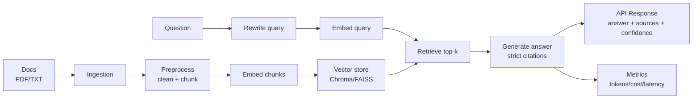

# Architecture

This system implements a **strict-grounding RAG pipeline**:

1. **Ingestion**: PDF/TXT → page text + metadata (source, page)
2. **Preprocessing**: cleaning → token-aware chunking (chunk_size + overlap)
3. **Indexing**: embed chunks → write to vector store (Chroma default; FAISS optional)
4. **Query time**:
   - optional query rewrite to improve recall
   - embed query
   - retrieve top-k chunks (+ optional hybrid/rerank)
   - grounded generation with mandatory citations
   - refusal if evidence is insufficient

## Data flow (Mermaid)

