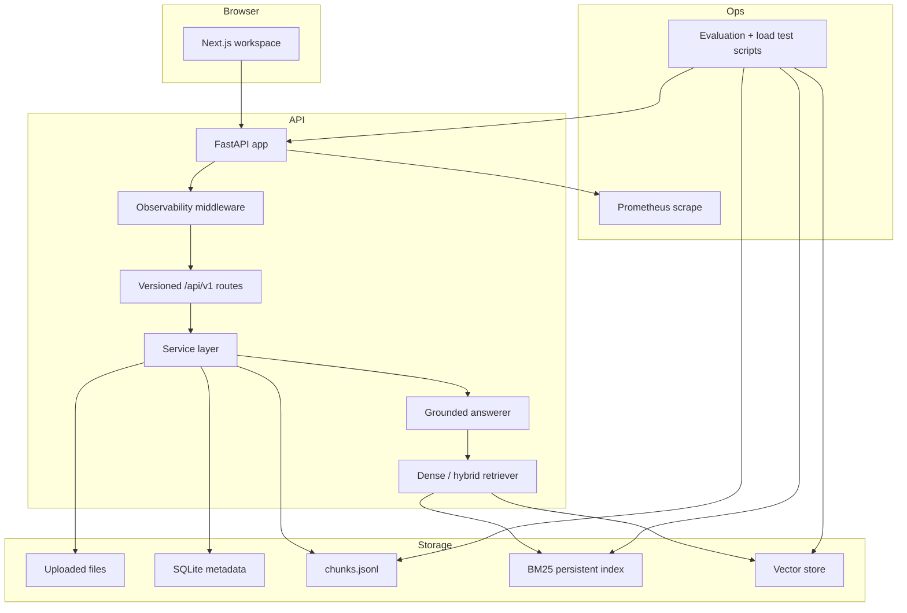

# Architecture

## Overview

`rag-smart-qa` is organized as a production-style RAG system with explicit orchestration instead of a hidden framework graph.

Core layers:

1. Ingestion and preprocessing convert local documents into normalized chunks.
2. Indexing builds BM25 and dense vector retrieval assets.
3. FastAPI exposes operational and product-facing endpoints.
4. Services manage uploads, metadata, summaries, and session-aware chat flows.
5. The answerer enforces strict grounding and refusal behavior.
6. Monitoring captures request, retrieval, generation, and refusal telemetry.
7. Evaluation scripts save reproducible artifacts under `experiments/metrics/`.

## Runtime topology

```mermaid
flowchart TD
  subgraph Browser
    UI[Next.js workspace]
  end

  subgraph API
    APP[FastAPI app]
    MID[Observability middleware]
    ROUTES[Versioned /api/v1 routes]
    SERVICES[Service layer]
    ANSWERER[Grounded answerer]
    RETRIEVER[Dense / hybrid retriever]
  end

  subgraph Storage
    FILES[Uploaded files]
    SQLITE[SQLite metadata]
    CHUNKS[chunks.jsonl]
    BM25[BM25 persistent index]
    VECTOR[Vector store]
  end

  subgraph Ops
    PROM[Prometheus scrape]
    EVAL[Evaluation + load test scripts]
  end

  UI --> APP
  APP --> MID
  MID --> ROUTES
  ROUTES --> SERVICES
  SERVICES --> SQLITE
  SERVICES --> FILES
  SERVICES --> ANSWERER
  ANSWERER --> RETRIEVER
  RETRIEVER --> BM25
  RETRIEVER --> VECTOR
  SERVICES --> CHUNKS
  APP --> PROM
  EVAL --> APP
  EVAL --> CHUNKS
  EVAL --> BM25
  EVAL --> VECTOR
```

## Request flow

### Upload and indexing

1. `POST /api/v1/documents/upload` stores the file and creates a metadata row immediately.
2. A background task rebuilds chunks, BM25, vector indexes, and summaries.
3. Document status transitions from `queued` -> `processing` -> `ready` or `failed`.

### Query and answer generation

1. The client calls `POST /api/v1/chat/query` or `POST /api/v1/query`.
2. Middleware assigns a request ID and correlation ID.
3. The retriever executes dense, BM25, or hybrid retrieval.
4. Optional reranking runs after candidate fusion.
5. The answerer classifies answerability and either:
   - returns a grounded answer with citations, or
   - refuses with a structured reason.
6. Metrics are recorded for latency, scores, errors, refusals, and token usage.

## API layout

- Operational compatibility endpoints: `/query`, `/metrics`, `/stats`, `/healthz`, `/readiness`
- Versioned application endpoints: `/api/v1/...`
- Compatibility aliases: `/api/...` are still mounted for the existing web app surface

## Data stores

- Files: local uploads under `data/raw/documents/uploads/`
- Metadata: SQLite at `data/processed/metadata/app.db`
- Chunk corpus: `data/processed/chunks/chunks.jsonl`
- Sparse index: `data/processed/indexes/bm25/`
- Dense index: Chroma by default, FAISS optional, Pinecone reserved as a deployment seam

## Monitoring model

- Structured JSON logs via `structlog`
- Request-scoped `request_id` and `correlation_id`
- Prometheus metrics for:
  - HTTP request count and latency
  - end-to-end query latency
  - retrieval latency
  - generation latency
  - retrieval score diagnostics
  - refusals and grounding outcomes
  - token and cost usage when available

## Deployment model

- Local process mode: `make api` + `make web`
- Local containers: `docker compose up --build`
- Cloud: documented Render deployment for API + web

## Reviewer-visible production traits

- Versioned public contract
- Structured error responses
- Health and readiness endpoints
- CI-backed backend and frontend quality gates
- Reproducible evaluation artifacts
- Explicit tradeoff and architecture docs
